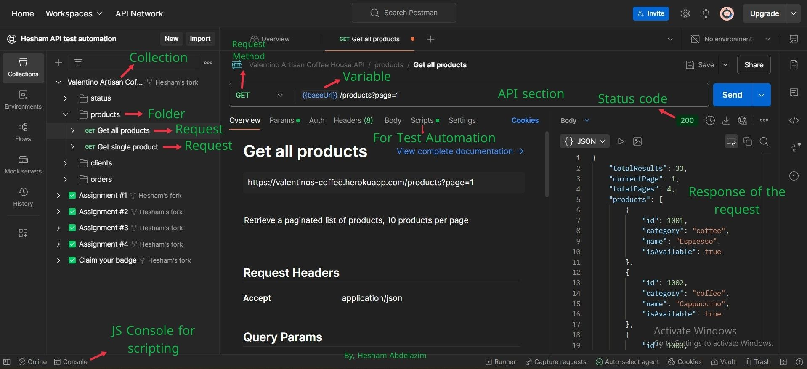

# Learn-Postman-with-me.
this is some main notes while my learning of Postman.
`Important notice`, You must try by yourself if you want to learn
the link of learning here `https://www.youtube.com/watch?v=zp5Jh2FIpF0`.

---
## Content of this Repo is the following
- Postman definition as a tool.
- Postman interface
- API requests methods & Status codes
- General notes through the course

---
## First: Postman definition as a tool
- Software platform that simplifies the process of working with APIs, making it easier for developers to interact with them.
- Used for building, testing, and documenting APIs.
- It automates requests, validates responses, and compares them against expected results

---
## Postman interface




1. You will find at the top `WorkSpaces` you can (create your own) or (fork from others)  
2. Every Workspace has its own collections + Enviornments 
3. A collection has (folders + requests) + some details like (variables + Auth + ...)
4. A folder that inside a collection has (sub-folders + requests)
5. A request contains all of API details that you need to `send` then watch the response and console of the script and most importnat thing is  the code status.

---
## API requests methods & Status codes
It's important to know that whoever makes requests to the server, We call him a client made a request. <br/>
So, In our situation here, Postman is a client to test our server response along with our API.<br/>
That does mean that client send to the server to do(to verb) something (GET data, POST data, DELETE data, PUT data, ...) <br/>

Firstly, In this section you need to know the <b>http methods</b> which they are (GET, POST, DELETE, PUT,...)<br/>
Secondly, you need to know after send to the server, What would the server say to you?<br/>
would it be Ok, not found or what? how to konw that? by <b>status code</b>

---
## In the script section (for automation)
- There are pre-request (before send) and post-request (after send)
- the best practice of pre-request is to set variables before send or setting variables.
- Postman uses `javascript syntax`.
- There's a third party library called chai.js which contains easy-readable methods like (.to .be  .an .have)
It is used by postman for writing assesrtions(checks)
---
## Varialbes
- In Postman and programming world, You tends to save time by making variables that has a common value to use it many times.
- for instance => `{{baseUrl}}` a variable we use many times in all of requests of the collection.
- Also, `APIKey` a variable we use many times for auth of the request.
- 
```javascript 
let test="string";
console.log(test);
```
